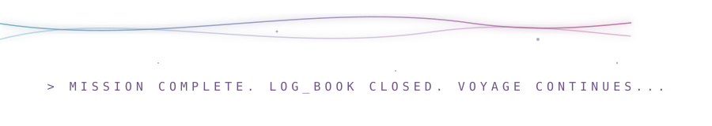

<div align="center">

<!-- ═══════════════════════════════════════════════════════════════════ -->
<!-- GALAXY COSMIC HEADER BANNER -->
<!-- ═══════════════════════════════════════════════════════════════════ -->



<br/><br/>

<!-- TYPING ANIMATION -->

<a href="https://git.io/typing-svg">
  <picture>
    <source media="(prefers-color-scheme: dark)" srcset="https://readme-typing-svg.demolab.com?font=Fira+Code&weight=600&size=24&duration=3000&pause=1000&color=FFC6FF&center=true&vCenter=true&repeat=true&width=700&height=45&lines=%F0%9F%9A%80+Crafting+premium+GitHub+READMEs;%F0%9F%92%BB+Master+of+PERN+Stack;%E2%9A%99%EF%B8%8F+Customizing+Odoo+ERP;%E2%9C%A8+Turning+caffeine+into+code;%F0%9F%8C%8C+Pushing+pixels+in+the+matrix" />
    <source media="(prefers-color-scheme: light)" srcset="https://readme-typing-svg.demolab.com?font=Fira+Code&weight=600&size=24&duration=3000&pause=1000&color=6D558A&center=true&vCenter=true&repeat=true&width=700&height=45&lines=%F0%9F%9A%80+Crafting+premium+GitHub+READMEs;%F0%9F%92%BB+Master+of+PERN+Stack;%E2%9A%99%EF%B8%8F+Customizing+Odoo+ERP;%E2%9C%A8+Turning+caffeine+into+code;%F0%9F%8C%8C+Pushing+pixels+in+the+matrix" />
    
  </picture>
</a>

<br/><br/>

<!-- ═══════════════════════════════════════════════════════════════════ -->
<!-- SOCIAL LINKS -->
<!-- ═══════════════════════════════════════════════════════════════════ -->

<a href="mailto:nvanhieuk13@gmail.com">
  
</a>
&nbsp;
<a href="https://www.nekovibecoder.site/">
  
</a>
&nbsp;
<a href="https://github.com/nicodolas">
  
</a>

<br/><br/>

<!-- PROFILE VIEWS -->


</div>

<!-- ═══════════════════════════════════════════════════════════════════ -->
<!-- SECTION DIVIDER -->
<!-- ═══════════════════════════════════════════════════════════════════ -->


<!-- ═══════════════════════════════════════════════════════════════════ -->
<!-- ABOUT ME -->
<!-- ═══════════════════════════════════════════════════════════════════ -->

<div align="center">

## 🪐 `> STELLAR_SYSTEM.INITIALIZE()` 🪐

</div>

```text
    ,______________.     nicodolas@spaceship-console
   /              /|     ---------------------------
  /             /  |     OS: Debian GNU/Linux / macOS
 /____________/    |     Host: Nguyễn Văn Hiếu (nicodolas)
|  _________  |    |     Kernel: PERN Stack & Odoo ERP
| |  >_     | |    |     Uptime: 20+ years of cosmic curiosity
| |         | |    |     Shell: zsh / bash / powershell
| |_________| |    |     Editor: VS Code / NeoVim
|             |  /       CPU: Coffee ☕ & Clean Layouts 🎨
 \___________/  /        RAM: 16GB Focus / 8GB Stellar Dust
   [_________]--'
```

<div align="center">

> 🚀 **Full-Stack & Odoo ERP Developer** — I specialize in crafting performant web applications using the **PERN stack (PostgreSQL, Express, React, Node.js)** and **Next.js**, alongside building custom enterprise solutions with **Odoo ERP**. I am passionate about clean architecture, modular system customization, and designing premium GitHub Profile READMEs. 🌌

<br/>

| 💻 Frontend Craft | ⚙️ Backend & ERP | 🎨 Profile Architecture |
|---|---|---|
| React, Next.js & Tailwind | Node.js, Express & PostgreSQL | Custom CSS/SVG Animations |
| Responsive & Modern UI | Odoo ERP (Python, XML, JS) | Premium README Layouts |

<br/>

</div>

<!-- ═══════════════════════════════════════════════════════════════════ -->
<!-- SECTION DIVIDER -->
<!-- ═══════════════════════════════════════════════════════════════════ -->


<!-- ═══════════════════════════════════════════════════════════════════ -->
<!-- TECH STACK -->
<!-- ═══════════════════════════════════════════════════════════════════ -->

<div align="center">

## 🛸 `> ORBITAL_MODULES.LAUNCH()` 🛸

<br/>


<br/><br/>

</div>

<!-- ═══════════════════════════════════════════════════════════════════ -->
<!-- SECTION DIVIDER -->
<!-- ═══════════════════════════════════════════════════════════════════ -->


<!-- ═══════════════════════════════════════════════════════════════════ -->
<!-- GITHUB STATS -->
<!-- ═══════════════════════════════════════════════════════════════════ -->

<div align="center">

## 🌌 `> COSMIC_STATS.SCAN()` 🌌

<br/>

<!-- TROPHY -->


<br/><br/>

<!-- 3D CONTRIBUTION CITY -->


<br/><br/>

<!-- STATS ROW -->


&nbsp;&nbsp;


<br/><br/>

<!-- STREAK -->


<br/><br/>

<!-- ACTIVITY GRAPH -->


<br/>

</div>

<!-- ═══════════════════════════════════════════════════════════════════ -->
<!-- SECTION DIVIDER -->
<!-- ═══════════════════════════════════════════════════════════════════ -->


<!-- ═══════════════════════════════════════════════════════════════════ -->
<!-- CONTRIBUTION SNAKE -->
<!-- ═══════════════════════════════════════════════════════════════════ -->

<div align="center">

## ☄️ `> STELLAR_SNAKE.ORBIT()` ☄️

<br/>

<picture>
  <source media="(prefers-color-scheme: dark)" srcset="https://raw.githubusercontent.com/nicodolas/nicodolas/output/github-snake-dark.svg" />
  <source media="(prefers-color-scheme: light)" srcset="https://raw.githubusercontent.com/nicodolas/nicodolas/output/github-snake.svg" />
  
</picture>

<br/>

</div>

<!-- ═══════════════════════════════════════════════════════════════════ -->
<!-- SECTION DIVIDER -->
<!-- ═══════════════════════════════════════════════════════════════════ -->


<!-- ═══════════════════════════════════════════════════════════════════ -->
<!-- FUN ZONE -->
<!-- ═══════════════════════════════════════════════════════════════════ -->

<div align="center">

## 🚀 `> LOG_BOOK.READ()` 🚀

<br/>

🔥 I believe **great code** is like a **well-designed system** — it needs solid architecture, clean flow, and attention to detail.

⚙️ Current side quest: Deep-diving into **Odoo ERP module customization** and robust workflows with **PERN stack**.

🌱 Always learning, always building, always styling profiles (and breaking/fixing them... mostly).

🎯 **2026 Goals**: Master Odoo ERP architecture • Publish open-source Odoo modules • Craft even more stunning profile designs 🚀

<br/>

---

<br/>


<br/><br/>


<br/>

💚 **Thanks for visiting my profile!** If you like what you see, consider giving a ⭐ to my repos!

<br/>

</div>

<!-- ═══════════════════════════════════════════════════════════════════ -->
<!-- FOOTER -->
<!-- ═══════════════════════════════════════════════════════════════════ -->


